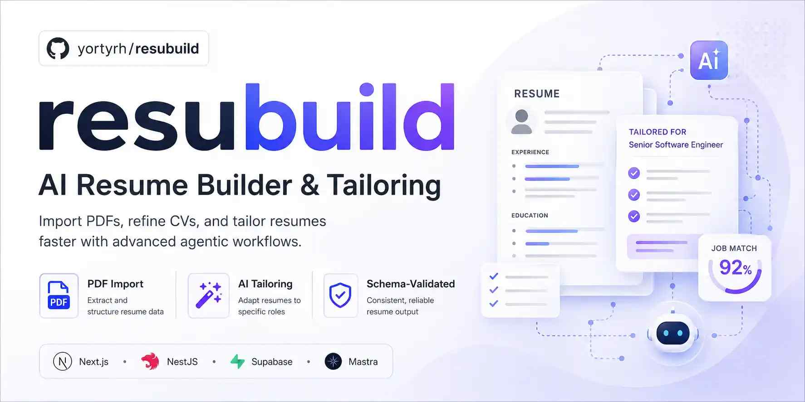

# Resubuild

> **Drop in a PDF. Get a clean, beautifully formatted CV in seconds.**

[](https://github.com/yortyrh/resubuild)
[](./LICENSE)

<p align="center">
  <a href="https://app.resubuild.dev"></a>
</p>

<p align="center">
  <a href="https://app.resubuild.dev">app.resubuild.dev</a> · <a href="#local-development-supabase-cli">Run it locally</a> · <a href="https://github.com/yortyrh/resubuild">GitHub</a>
</p>



## What it does

- **AI PDF import** — upload any existing CV as a PDF, and Resubuild extracts the structured resume data for you.
- **Clean MIT-format editor** — tweak every section in a focused, keyboard-friendly editor. No formatting fight, no broken layouts.
- **One-click PDF export** — what you see in the preview is what you get in the downloaded PDF. No watermarks, no surprises.
- **Your CVs, your account** — sign in, and your CVs are saved under your account, private to you.


---

## For developers

Monorepo for managing CVs with **Next.js** (UI), **NestJS** (REST API + authentication + schema validation), and **Supabase Postgres** (RLS-protected storage). Auth is **API-issued Bearer tokens** (JSON over CORS). The web bundle embeds the **Supabase publishable client** (`@supabase/supabase-js`) **only** for the auth flows listed in the [`authentication`](openspec/specs/authentication/spec.md) spec — the **publishable key** is the only Supabase key allowed in client bundles; **service-role keys remain server-only** (see [`apps/web/src/lib/web-bundle-security.test.ts`](apps/web/src/lib/web-bundle-security.test.ts) for the lint-style guard).

### Stack

- **apps/web** — Next.js App Router, shadcn-style UI, token session in `sessionStorage`, calls Nest at `NEXT_PUBLIC_API_URL`
- **apps/api** — NestJS REST API, `/auth/*` issuance + JWT guard, AJV validation against [JSON Resume schema](https://raw.githubusercontent.com/jsonresume/resume-schema/refs/heads/master/schema.json)
- **apps/import-agent** — Mastra PDF import workflow and reusable verification tools
- **packages/schemas** — official resume JSON schema
- **packages/types** — shared TypeScript resume types
- **packages/resume-template** — MIT-format HTML renderer for preview and PDF export
- **packages/import-models** — pinned Mastra provider/model catalog for PDF import settings
- **supabase/migrations** — `cv` table + RLS policies

## Authentication

Resubuild's authentication is split between the **Nest API** (token issuance, validation, and the service-role Supabase client) and the **Next.js web SPA** (a publishable-key Supabase client for the auth UI only). The two halves are wired by the `authentication`, `web-application`, and the new `auth-feature-flags`, `auth-password-recovery`, `auth-email-verification`, `auth-passwordless`, and `auth-change-password` OpenSpec specs.

### Auth flows

| Flow                              | Always on? | Feature flag (client-side mirror)             | OpenSpec spec             |
| --------------------------------- | ---------- | --------------------------------------------- | ------------------------- |
| Email + password login / register | yes        | —                                             | `authentication`          |
| Change password (authenticated)   | yes        | —                                             | `auth-change-password`    |
| Forgot / reset password           | opt-in     | `NEXT_PUBLIC_AUTH_FORGOT_PASSWORD_ENABLED`    | `auth-password-recovery`  |
| Email verification                | opt-in     | `NEXT_PUBLIC_AUTH_EMAIL_VERIFICATION_ENABLED` | `auth-email-verification` |
| Passwordless — magic link         | opt-in     | `NEXT_PUBLIC_AUTH_PASSWORDLESS_ENABLED`       | `auth-passwordless`       |
| Passwordless — 6-digit OTP        | opt-in     | `NEXT_PUBLIC_AUTH_PASSWORDLESS_ENABLED`       | `auth-passwordless`       |
| GitHub OAuth                      | opt-in     | `NEXT_PUBLIC_AUTH_GITHUB_OAUTH_ENABLED`       | `auth-github-oauth`       |

### Feature flags

The optional auth flows are gated by **client-side `NEXT_PUBLIC_*` env vars** in `apps/web/.env`. The SPA reads them at build time via `process.env.NEXT_PUBLIC_*` (resolved by `apps/web/src/lib/auth/features.ts`); no API round-trip, no layout shift on auth pages. Each value is interpreted as a strict boolean — only the literal string `true` enables the flag; anything else (including the empty string, `1`, `yes`, `TRUE`) is treated as `false`, and a missing var defaults to `false`. Flipping a flag requires a web redeploy to take effect in production.

The only flag that **also** lives on the API side is `AUTH_FORGOT_PASSWORD_ENABLED` in `apps/api/.env` — it is consumed by the server-side `ForgotPasswordEnabledGuard` on `POST /auth/forgot-password` and `POST /auth/reset-password` so a misconfigured SPA cannot trigger recovery emails when the API operator has disabled the flow. `NEXT_PUBLIC_AUTH_FORGOT_PASSWORD_ENABLED` is a mirror for the UI; the two must agree at runtime. `setup:env` writes the same value to both files.

```bash
# apps/web/.env — mirror to apps/api/.env for the forgot-password one only
NEXT_PUBLIC_AUTH_FORGOT_PASSWORD_ENABLED=true
NEXT_PUBLIC_AUTH_EMAIL_VERIFICATION_ENABLED=true
NEXT_PUBLIC_AUTH_PASSWORDLESS_ENABLED=true
NEXT_PUBLIC_AUTH_GITHUB_OAUTH_ENABLED=true

# apps/api/.env — only the server-side flag
AUTH_FORGOT_PASSWORD_ENABLED=true
```

The `NEXT_PUBLIC_AUTH_GITHUB_OAUTH_ENABLED` flag controls whether the SPA renders the **Continue with GitHub** button on `/login` and `/register`. Enabling it is **necessary but not sufficient**: the Supabase project must also have a real `[auth.external.github]` provider configured (locally, that means non-stub `GITHUB_OAUTH_CLIENT_ID` and `GITHUB_OAUTH_SECRET` in `supabase/.env`; in production, the equivalent provider keys in the Supabase Cloud dashboard). `setup:env` writes `github-oauth-stub` placeholders on first run so `supabase start` boots, but those placeholders make `signInWithOAuth` fail at click time — replace them with the real client_id and secret from a GitHub OAuth app registration to go live. The button-gating flag and the provider credentials are independent so a misconfigured GitHub app never silently leaks failed OAuth attempts to the UI. See `openspec/specs/auth-github-oauth/spec.md` for the end-to-end flow.

### Required env vars

| Where      | Var                                    | Purpose                                                                                                                                                             |
| ---------- | -------------------------------------- | ------------------------------------------------------------------------------------------------------------------------------------------------------------------- |
| `apps/api` | `SUPABASE_URL`                         | Supabase project URL (server)                                                                                                                                       |
| `apps/api` | `SUPABASE_SERVICE_ROLE_KEY`            | Service-role key for `auth.admin` operations (server-only)                                                                                                          |
| `apps/api` | `SUPABASE_PUBLISHABLE_KEY`             | Publishable key mirrored to the SPA (the web bundle also reads its own `NEXT_PUBLIC_SUPABASE_PUBLISHABLE_KEY`)                                                      |
| `apps/web` | `NEXT_PUBLIC_SUPABASE_URL`             | Public Supabase URL for the auth client                                                                                                                             |
| `apps/web` | `NEXT_PUBLIC_SUPABASE_PUBLISHABLE_KEY` | The **only** Supabase key in the browser bundle                                                                                                                     |
| `supabase` | `GITHUB_OAUTH_CLIENT_ID`               | GitHub OAuth app client_id, consumed by `[auth.external.github]` in `supabase/config.toml` (non-functional `github-oauth-stub` written by `setup:env` on first run) |
| `supabase` | `GITHUB_OAUTH_SECRET`                  | GitHub OAuth app client_secret (same source of truth as the client_id)                                                                                              |

### Two-knob email verification

Email verification is gated by **two** independent settings, and the operator is responsible for keeping them in sync:

1. `NEXT_PUBLIC_AUTH_EMAIL_VERIFICATION_ENABLED=true` in `apps/web/.env` — controls whether the SPA routes unverified signups to `/auth/check-email`. This is the only auth capability flag for email verification; the API does not gate `GET /auth/email-verified` behind a server-side flag, and the previous `AUTH_EMAIL_VERIFICATION_ENABLED` env var was removed from `apps/api/.env` and `AuthConfigService`'s Zod schema.
2. `[auth.email].enable_confirmations = true` in `supabase/config.toml` — tells Supabase itself to send the confirmation email.

**Misconfiguration states:**

- `NEXT_PUBLIC_AUTH_EMAIL_VERIFICATION_ENABLED=true` but `enable_confirmations = false` → the SPA shows the "check your email" page, but the user never receives an email.
- `NEXT_PUBLIC_AUTH_EMAIL_VERIFICATION_ENABLED=false` but `enable_confirmations = true` → Supabase sends the email, but the SPA has no verification flow to send the user through.
- Both `false` → no email verification at all (default).

There is no auto-sync. The `setup-local-env.sh` script defaults both to the same value to keep dev sane; production operators must verify both are set before flipping the feature on.

In **local development**, confirmation and passwordless emails do not leave your machine — they appear in [Mailpit](#local-auth-emails-mailpit) at http://127.0.0.1:54324.

### Bundle security guard

`apps/web/src/lib/web-bundle-security.test.ts` is a Vitest guard that fails CI if any web source file references the service-role key, imports from `apps/api/src/cv/**` or `apps/api/src/database/**`, or uses `@supabase/supabase-js` outside the auth-flow scope. It also asserts the carve-out is documented in `README.md` / `.env.example` / the OpenSpec specs.

## Prerequisites

- Node.js 20+
- pnpm 10+
- [Supabase CLI](https://supabase.com/docs/guides/cli) (for local development)

## Local development (Supabase CLI)

For day-to-day work on your machine, use the local Supabase stack and the seed script. No cloud project required.

### Setup

From the repo root:

```bash
pnpm install
supabase start
pnpm setup:env      # writes apps/api/.env and apps/web/.env (Supabase + PDF import defaults)
pnpm samples:seed   # creates dev + E2E accounts, sample CVs, and media (no API needed)
```

On first seed, **unique passwords are generated for your machine** and saved to `.samples/local-credentials.json` (gitignored). The seed prints them to the terminal. To show them again later:

```bash
pnpm local:credentials
```

**Developer sign-in** (use this in the browser):

- Email: `developer@resubuild.local`
- Password: run `pnpm local:credentials` (not committed to git)

### Run the app

```bash
pnpm dev            # web :3000 + api :3001
```

Open http://localhost:3000, sign in with the developer account, and you should see 10 sample CVs on the dashboard.

### Local auth emails (Mailpit)

Local Supabase does **not** deliver auth email to real inboxes. Messages are captured by **Mailpit** (enabled via `[inbucket] enabled = true` in `supabase/config.toml`).

**Inbox URL:** http://127.0.0.1:54324

After `supabase start`, the CLI prints the Mailpit URL under **Development Tools**. You can also run `supabase status` to see it again.

When `pnpm dev` targets local Supabase (`NEXT_PUBLIC_SUPABASE_URL` on `localhost` / `127.0.0.1`), the web app shows a dashed **Development** banner on login, register, forgot-password, and check-email screens with a direct Mailpit link. It is omitted in production builds and when the SPA points at cloud Supabase.

Use Mailpit when testing any flow that sends email:

| Flow                    | Where to trigger it                  | What to look for in Mailpit     |
| ----------------------- | ------------------------------------ | ------------------------------- |
| Signup confirmation     | `/register`                          | Confirmation link               |
| Forgot password         | `/login` → **Forgot your password?** | Reset link → `/reset-password`  |
| Email code (OTP)        | `/login` → **Email code** tab        | 6-digit code                    |
| Email link (magic link) | `/login` → **Email link** tab        | Sign-in link → `/auth/callback` |

**Quick OTP / magic-link check**

1. Enable `NEXT_PUBLIC_AUTH_PASSWORDLESS_ENABLED=true` in `apps/web/.env` and restart `pnpm dev`.
2. On `/login`, use the **Email code** or **Email link** tab with `developer@resubuild.local` (or any registered address).
3. Open Mailpit, open the newest message, and use the code or click the link.

Emails are not sent in production-like Docker/cloud setups unless you configure SMTP in the Supabase dashboard.

### CV preview and PDF export

From any CV editor, use **Preview** to open `/dashboard/cv/[id]/preview` — a print-faithful MIT-format HTML view of the assembled resume (experience before education, ruled section headings). **Print** uses the browser; **Download PDF** calls `GET /cv/:id/export/pdf` on the API.

PDF generation uses headless Chromium (Puppeteer) in `apps/api`. For local dev, Puppeteer downloads its own browser. In production Docker, set `CHROMIUM_EXECUTABLE_PATH` to a system Chromium binary if the bundled browser is unavailable. HTML preview works without Chromium; PDF returns `503` when launch fails.

Regenerate sample PDFs from JSON fixtures: `pnpm samples:pdf` (builds `@resubuild/resume-template` first).

### PDF import smoke (optional)

Requires a real provider API key in AI agent settings. `pnpm setup:env` generates `AI_AGENT_ENCRYPTION_KEY`. Optional Tavily or Firecrawl keys for URL import and web lookup are saved per user in the app (Settings → AI agent), not in server env.

1. Open `/dashboard/settings/import-llm`, pick provider → model → API key, and save.
2. Generate sample PDFs if needed: `pnpm samples:pdf`
3. On `/dashboard/cv/new`, use **Import PDF** with a file from `.samples/resumes/pdf/`.
4. Wait for the job to finish and confirm the editor shows extracted sections.

Manual checks:

- Invalid model id → settings save error, PDF import stays gated.
- Valid model + bad API key → `422`, PDF import stays disabled.
- Non-PDF or oversize upload → client/API error, no CV created.

### Optional — verify the stack

E2E tests boot Nest in-process (no separate `pnpm dev:api` needed) and use the dedicated E2E account from `local-credentials.json`:

```bash
pnpm test:e2e       # 11 integration tests against local Supabase
```

Re-run `pnpm samples:seed` after resetting Supabase (`supabase db reset`) or to refresh sample data. Passwords stay the same unless you delete `.samples/local-credentials.json`.

---

## Cloud Supabase setup

For deployment or a shared remote database:

1. Create a project at [supabase.com](https://supabase.com).
2. Enable **Email** auth (Authentication → Providers).
3. Apply the database migration (creates `public.cv`, RLS policies, and triggers).

**Recommended — Supabase CLI**

```bash
supabase login
supabase link --project-ref <your-project-ref>
supabase db push
```

`<your-project-ref>` is the ID in your project URL: `https://<project-ref>.supabase.co`.

**Alternative — SQL editor**

Paste and run migrations from `supabase/migrations/` in Supabase → **SQL Editor**.

---

## Release 1: cloud Supabase + docker compose

Deploy the system to a production docker compose stack connected to a non-self-hosted (cloud) Supabase project.

> **Minimum viable target.** This release ships without TLS, a reverse proxy, or a container registry push. Those concerns are addressed by follow-on release-1 changes. See [openspec/specs/prod-env-bootstrap-helper/spec.md](openspec/specs/prod-env-bootstrap-helper/spec.md) for the full scope.

### Prerequisites

Before starting, you need from your Supabase dashboard:

- **Supabase project URL** → Project Settings → API → "Project URL"
- **Supabase anon key** → Project Settings → API → "anon / public" key
- **Supabase service role key** → Project Settings → API → "service_role" key (**treat as server-only**)
- **Two Storage buckets** named `media` and `mcp-exports` (create them under Storage in the Supabase dashboard)
- **Public URL** for this deployment (e.g., `https://app.example.com`)

The `supabase link` / `supabase db push` step from the **Cloud Supabase setup** section above is also required to apply migrations to your cloud project.

### Step 1 — Generate `.env.prod`

From the repo root:

```bash
pnpm setup:env:prod
```

The script prompts for all required variables and auto-generates an `AI_AGENT_ENCRYPTION_KEY` if you don't supply one.

**LLM agent flow:** Use the `/opsx:setup-prod-env` command or load the [`.cursor/skills/setup-prod-env/SKILL.md`](.cursor/skills/setup-prod-env/SKILL.md) to drive the generator as an agent. Both write a `prod-secrets.json` manifest to disk (gitignored) and invoke the script via `--from` so secret values never appear in chat.

**Dry-run preview:**

```bash
pnpm setup:env:prod:dry-run --from prod-secrets.json
```

### Step 2 — Verify docker compose

```bash
docker compose -f docker-compose.prod.yml --env-file .env.prod config
```

### Step 3 — Bring up the stack

```bash
docker compose -f docker-compose.prod.yml --env-file .env.prod up
```

Both services (`web`, `api`) read from `.env.prod`. The `api` service mounts a named volume (`resubuild-puppeteer-cache`) so Chromium is not re-downloaded on every container restart.

### Files

| File                                                                                                   | Purpose                                                 |
| ------------------------------------------------------------------------------------------------------ | ------------------------------------------------------- |
| [`scripts/setup-prod-env.mjs`](scripts/setup-prod-env.mjs)                                             | Script engine                                           |
| [`scripts/lib/env-prod-schema.mjs`](scripts/lib/env-prod-schema.mjs)                                   | Schema module (shared by script, SKILL, cursor command) |
| [`docker-compose.prod.yml`](docker-compose.prod.yml)                                                   | Compose definition                                      |
| [`.cursor/skills/setup-prod-env/SKILL.md`](.cursor/skills/setup-prod-env/SKILL.md)                     | LLM agent workflow                                      |
| [`.cursor/commands/setup-prod-env.md`](.cursor/commands/setup-prod-env.md)                             | Cursor command (`/opsx:setup-prod-env`)                 |
| [`openspec/specs/prod-env-bootstrap-helper/spec.md`](openspec/specs/prod-env-bootstrap-helper/spec.md) | Full spec                                               |

### Deploy to Railway (parallel managed target)

The same env-var surface can deploy to a managed Railway project. The Railway target reuses `apps/api/Dockerfile` and `apps/web/Dockerfile` verbatim — no `Dockerfile.railway` fork. The env generator is the same; pass `--target railway` so the four public-URL keys (`CORS_ORIGIN`, `APP_URL`, `PUBLIC_API_URL`, `NEXT_PUBLIC_API_URL`) default to the production custom domains (`https://app.resubuild.dev` for the web app, `https://api.resubuild.dev` for the API). No find-and-replace step is required as long as the operator attaches the matching custom domains to the corresponding services in the Railway dashboard.

The pre-gathered env vars are the same list documented under **Prerequisites** above (Project URL, anon key, service role key, two storage bucket names). The same `pnpm setup:env:prod` flow writes the manifest to `prod-secrets.json`; only the `--target` flag changes:

```bash
pnpm setup:env:prod --target railway --from prod-secrets.json
```

| File                                                                                                                                           | Purpose                                                          |
| ---------------------------------------------------------------------------------------------------------------------------------------------- | ---------------------------------------------------------------- |
| [`apps/api/railway.json`](apps/api/railway.json)                                                                                               | Service config for the api service (build + start)               |
| [`apps/web/railway.json`](apps/web/railway.json)                                                                                               | Service config for the web service (build + start)               |
| [`.railwayignore`](.railwayignore)                                                                                                             | Build context exclusions                                         |
| [`scripts/deploy-railway.mjs`](scripts/deploy-railway.mjs)                                                                                     | Preflight wrapper (`pnpm deploy:railway`)                        |
| [`.cursor/skills/railway-deploy/SKILL.md`](.cursor/skills/railway-deploy/SKILL.md)                                                             | LLM agent workflow (includes custom-domain + App Sleeping steps) |
| [`.cursor/commands/railway-deploy.md`](.cursor/commands/railway-deploy.md)                                                                     | Cursor command (`/opsx:railway-deploy`)                          |
| [`openspec/changes/railway-deployment/specs/railway-deployment/spec.md`](openspec/changes/railway-deployment/specs/railway-deployment/spec.md) | Full spec                                                        |

**Service topology and scale-to-zero.** The release-1 Railway target deploys two services (one `api`, one `web`) into a single Railway project. Each service has `apps/{api,web}/railway.json` at its service root directory so Railway's monorepo auto-detect locates the build config next to its `Dockerfile`. Both services should run on their existing `apps/{api,web}/Dockerfile` and scale to zero when idle. The scale-to-zero toggle (Railway's "App Sleeping") is a per-service dashboard setting in **Settings → App Sleeping** — enable it after each service is created and trigger a new deployment for the change to take effect. App Sleeping is not a `railway.json` field and cannot be enforced by config-as-code; the SKILL and command document the toggle explicitly.

**Known limitations (scope statements, not TODOs):**

- No persistent Puppeteer cache volume on the Railway free tier — the api service re-downloads Chromium (~181 MiB) on every cold start from App Sleeping (and on every fresh deploy).
- No preview / ephemeral environments per pull request.
- The two services communicate over the public internet (or, on paid plans, over a Railway private network), not over a docker compose bridge network. CORS must be configured for the public origin.

**Verify:**

```bash
curl -f https://api.resubuild.dev/_health
curl -f https://app.resubuild.dev/
```

Collect from **Project Settings → API**:

- Project URL → **`SUPABASE_URL`**
- anon public key → **`SUPABASE_ANON_KEY`**

Then configure env files:

```bash
cp apps/web/.env.example apps/web/.env.local
cp apps/api/.env.example apps/api/.env
```

## Quality checks

From the repo root:

- **`pnpm format`** / **`pnpm format:check`** — Prettier
- **`pnpm lint`** / **`pnpm lint:fix`** — Biome
- **`pnpm typecheck`** — TypeScript across all packages
- **`pnpm verify`** — full CI pipeline locally (Prettier, Biome, typecheck, unit tests, build)
- **`pnpm test`** — unit tests (Vitest + Jest)
- **`pnpm test:e2e`** — integration tests against local Supabase (requires setup above)
- **`pnpm local:credentials`** — show local dev and E2E login details for this machine

Git hooks (Lefthook): **pre-commit** (Biome + Prettier on staged files), **pre-push** (`pnpm verify`).

### Toolchain memory budget

The verify pipeline caps parallelism to keep peak memory under ~4 GB per process
on constrained environments (CI runners, laptops). Defaults:

| Tool                                     | Default cap                                   |
| ---------------------------------------- | --------------------------------------------- |
| Jest (`apps/api` unit tests)             | `--maxWorkers=2`                              |
| Vitest (all workspaces)                  | `singleFork: true` (one fork)                 |
| Turborepo (`test`, `build`, `typecheck`) | `concurrency: 2`                              |
| Prettier (`pnpm format`, `format:check`) | `--concurrency=2`                             |
| Biome                                    | unchanged (~250 MB peak)                      |
| GitHub Actions CI                        | 2 parallel jobs (`quality`, `test-and-build`) |

To raise the cap on a larger machine, set the `RESUME_PARALLELISM` env var:

```bash
RESUME_PARALLELISM=8 pnpm verify   # 8 workers/forks for Jest, Vitest, Turborepo, Prettier
```

`RESUME_PARALLELISM` is not honored by Biome or GitHub Actions CI (those always
use the conservative defaults).

## Troubleshooting

| Error                                                      | Fix                                                                                                   |
| ---------------------------------------------------------- | ----------------------------------------------------------------------------------------------------- |
| `Could not find the table 'public.cv' in the schema cache` | Run `supabase db push` or `supabase start` with migrations applied.                                   |
| `Invalid or expired token`                                 | Sign out and sign in again. Ensure `SUPABASE_*` vars in `apps/api/.env` match your Supabase instance. |
| Forgot local dev password                                  | Run `pnpm local:credentials`.                                                                         |
| `pnpm verify` fails on Node version                        | Use Node **22** (see `.nvmrc`). CI uses 22; newer Node can hide test failures that break in CI.       |

## Debugging the API

See [`apps/api/README.md`](apps/api/README.md#debugging-the-api) for the full guide covering `pnpm dev:api:debug`, the VS Code / Cursor launch configuration, `pnpm local:devtools`, and the `inspector-mcp` option for agent debugging.

## API (`apps/api`)

Authenticate with Bearer tokens from **`POST /auth/login`** / **`POST /auth/register`**. The UI stores tokens in **`sessionStorage`**.

| Method | Path                                       | Description                                             |
| ------ | ------------------------------------------ | ------------------------------------------------------- |
| GET    | `/cv`                                      | List user's CVs                                         |
| GET    | `/cv/:id`                                  | Get one CV                                              |
| POST   | `/cv`                                      | Create `{ title?, data }`                               |
| PATCH  | `/cv/:id`                                  | Update `{ title?, data? }`                              |
| DELETE | `/cv/:id`                                  | Delete CV                                               |
| GET    | `/cv/:id/export/html`                      | Full MIT-format HTML document (auth)                    |
| GET    | `/cv/:id/export/pdf`                       | PDF bytes (`Content-Disposition` attachment)            |
| GET    | `/cv/:id/export/json`                      | JSON Resume download (`Content-Disposition` attachment) |
| GET    | `/import/llm/providers`                    | List PDF import LLM providers                           |
| GET    | `/import/llm/providers/:providerId/models` | List models for a provider                              |
| GET    | `/import/llm/config`                       | Current user's import LLM settings                      |
| PUT    | `/import/llm/config`                       | Save provider/model/API key                             |
| POST   | `/cv/import/pdf`                           | Start async PDF import (`202`, `{ jobId }`)             |
| GET    | `/cv/import/:jobId`                        | Poll PDF import job status                              |

## Security

- Row Level Security on `public.cv`: users only access their own rows (`auth.uid() = user_id`).
- Nest validates Supabase access tokens via `auth.getUser()` and forwards the user token to Supabase so RLS applies.

## Project structure

```
apps/
  api/          NestJS REST API
  import-agent/ Mastra PDF import workflow
  web/          Next.js frontend
packages/
  import-models/ pinned Mastra provider/model catalog
  resume-template/ MIT HTML renderer for preview/PDF export
  schemas/      resume.schema.json
  types/        shared Resume types
supabase/
  migrations/   database schema
.samples/       seed fixture (CVs, media, local credentials)
```
