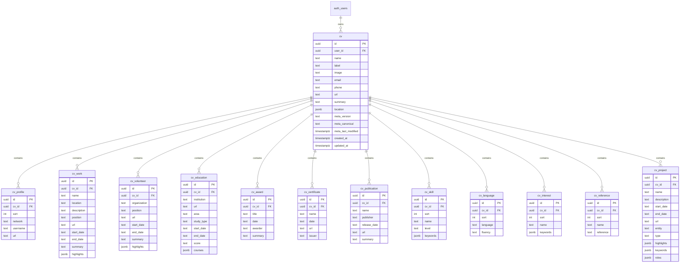

## Context

Resumind persists CVs in `public.cv` with a single `data jsonb` column holding the full JSON Resume document. The Nest `CvItemService` loads the entire document for every section mutation (basics patch, work create, skill delete, etc.), clones it in memory, validates the whole resume, and writes the blob back. The web editor loads the full CV on mount even though each tab only renders one section.

The JSON Resume schema defines a singleton `basics` object (with nested `location` and `profiles[]`), twelve top-level array sections, and Resumind-specific `meta`. String-list fields (`work.highlights`, `education.courses`, `skills.keywords`, `projects.keywords`, `projects.roles`, `interests.keywords`) are arrays of strings in JSON but do not warrant separate relational tables at this scale.

Constraints: Supabase Postgres with RLS; SPA talks only to Nest (no direct Supabase from web); JSON Resume remains the interchange format for import, export, and schema validation; existing item-scoped REST routes and editor UX should remain stable where possible.

## Goals / Non-Goals

**Goals:**

- Normalize CV content into relational tables with one row per multi-valued entity.
- Keep a `sort` column only on sections that are not unique per `cv_id` and lack a date field for natural ordering: `cv_profile`, `cv_skill`, `cv_language`, `cv_interest`, `cv_reference`. Auto-assign `sort` on create (`max(sort) + 1` within the same `cv_id`).
- List date-primary sections (`cv_work`, `cv_volunteer`, `cv_education`, `cv_award`, `cv_certificate`, `cv_publication`, `cv_project`) ordered by their date attributes (`start_date`, `end_date`, `date`, or `release_date` as applicable), descending by default so the most recent entry appears first. No `sort` column on those tables.
- Store JSON Resume `basics` scalar fields and nested `location` on the `cv` row (1:1 with the document header); no separate `cv_basics` table.
- Store string-list attributes as `jsonb` arrays on the parent entity row; store nested singleton objects (`basics.location`) as `jsonb` on the `cv` row when they do not warrant a separate table.
- Enable section-scoped reads and writes so editor views fetch only the data they need.
- Assemble a full JSON Resume document on demand for preview, export, import verification, and full-document validation.
- Preserve RLS isolation per user across all new tables.
- Expose reorder endpoints for the five `sort`-backed sections so clients can persist manual order updates.
- Document the relational model with an ER diagram and table dictionary in this file.
- Migrate existing `cv.data` rows to normalized tables with a reversible cutover plan.

**Non-Goals:**

- Normalizing string-list items (`highlights`, `courses`, `keywords`, `roles`) into child tables — they stay as `jsonb` on the parent row.
- Normalizing `basics.location` into its own table — it stays as a `jsonb` object on `cv`.
- Changing the JSON Resume interchange schema or public export format.
- Real-time collaboration or CRDT-based merging.
- Client-side direct Supabase access.
- Drag-and-drop reorder UI — handled by the separate `reorder-non-date-cv-sections` change (UI only; this change ships `sort` columns, auto-assignment on create, and reorder API endpoints).

## Relational Model

### Entity-Relationship Diagram

### Table Dictionary

| Table            | Cardinality    | Order column   | `jsonb` string lists              | Notes                                                                                                                                |
| ---------------- | -------------- | -------------- | --------------------------------- | ------------------------------------------------------------------------------------------------------------------------------------ |
| `cv`             | 1 per document | —              | `location`                        | Header row; holds JSON Resume `basics` scalars, `location` jsonb, and flattened `meta_*`; `data` and `title` dropped after migration |
| `cv_profile`     | 0–N            | `sort`         | —                                 | JSON Resume `basics.profiles[]`; manual order; auto-assigned on create                                                               |
| `cv_work`        | 0–N            | `start_date`   | `highlights`                      | List by `start_date DESC`, then `end_date DESC`, then `id ASC`                                                                       |
| `cv_volunteer`   | 0–N            | `start_date`   | `highlights`                      | Same date ordering as work                                                                                                           |
| `cv_education`   | 0–N            | `start_date`   | `courses`                         | Same date ordering as work                                                                                                           |
| `cv_award`       | 0–N            | `date`         | —                                 | List by `date DESC`, then `id ASC`                                                                                                   |
| `cv_certificate` | 0–N            | `date`         | —                                 | List by `date DESC`, then `id ASC`                                                                                                   |
| `cv_publication` | 0–N            | `release_date` | —                                 | List by `release_date DESC`, then `id ASC`                                                                                           |
| `cv_skill`       | 0–N            | `sort`         | `keywords`                        | Manual order; auto-assigned on create                                                                                                |
| `cv_language`    | 0–N            | `sort`         | —                                 | Manual order; auto-assigned on create                                                                                                |
| `cv_interest`    | 0–N            | `sort`         | `keywords`                        | Manual order; auto-assigned on create                                                                                                |
| `cv_reference`   | 0–N            | `sort`         | —                                 | Manual order; column `reference` holds the quote text                                                                                |
| `cv_project`     | 0–N            | `start_date`   | `highlights`, `keywords`, `roles` | List by `start_date DESC`, then `end_date DESC`, then `id ASC`                                                                       |

**Indexes:** `(cv_id, sort)` on the five `sort`-backed tables; `(cv_id, start_date)` or `(cv_id, date)` / `(cv_id, release_date)` on date-primary tables as appropriate; `(user_id, updated_at desc)` remains on `cv`. **RLS:** each child table policy joins to `cv` and checks `cv.user_id = auth.uid()`.

**Computed `title`:** The API derives display title from `cv.name` and `cv.label` via `deriveCvTitleFromBasics` at response time. It is not stored in the database.

**Default `jsonb`:** string-list columns default to `'[]'::jsonb`; `cv.location` defaults to `'{}'::jsonb`; never `null` in application code.

## Decisions

### 1. Normalized tables instead of JSONB document blob

**Choice:** One Postgres table per JSON Resume array section, with `basics` scalar fields and nested `location` jsonb on the `cv` row (1:1 with the document) plus an ordered `cv_profile` table for `basics.profiles[]`.

**Rationale:** Section-scoped SELECT/INSERT/UPDATE/DELETE; smaller write payloads; manual reorder for non-date sections only touches `sort` values; clearer query plans for list endpoints.

**Alternatives considered:**

- Keep JSONB and add generated columns — still full-document rewrite on each mutation.
- JSONB per section on `cv` (`work jsonb`, `skills jsonb`) — partial improvement but no stable row ids and awkward RLS per section.

### 2. Two ordering strategies: date fields vs `sort` column

**Choice:** Only `cv_profile`, `cv_skill`, `cv_language`, `cv_interest`, and `cv_reference` carry a `sort int not null` column. On create, the service auto-assigns `sort = max(sort) + 1` within the same `cv_id` (starting at 0 when the section is empty). List queries for those tables use `ORDER BY sort ASC, id ASC`.

Date-primary tables (`cv_work`, `cv_volunteer`, `cv_education`, `cv_project`) list by `start_date DESC, end_date DESC NULLS FIRST, id ASC`. `cv_award` and `cv_certificate` list by `date DESC, id ASC`. `cv_publication` lists by `release_date DESC, id ASC`. Those tables have no `sort` column.

Public REST paths remain `/cv/:cvId/work/:index` where `index` is the zero-based position after the section's list ordering. Manual reorder for the five `sort`-backed sections is exposed via `PUT /cv/:cvId/{section}/reorder` (see Decision 9).

**Rationale:** Date sections have a natural chronological order; manual `sort` on every table was redundant and could drift from dates. The five non-date sections need explicit user-controlled order. Matches current `cv-item-crud` contract; stable internal `uuid` primary keys survive reorder without row replacement.

**Alternatives considered:**

- `sort` on every multi-valued table — rejected; date sections should order by their date fields.
- Expose row UUID in URLs — cleaner internally but breaking change for clients and e2e tests.

### 9. Reorder API for `sort`-backed sections

**Choice:** Add `PUT /cv/:cvId/{section}/reorder` for `profiles`, `skills`, `languages`, `interests`, `references`. Request body: `{ version, order: uuid[] }` (full permutation of row ids). Server assigns `sort = index` in one transaction and bumps `cv.meta_version`.

**Rationale:** Persistence layer for manual order belongs with normalized storage; the `reorder-non-date-cv-sections` change adds only the React drag-and-drop UI that calls these endpoints.

**Alternatives considered:**

- Sparse `sort` gaps (10, 20, 30) — unnecessary at resume scale; dense 0..n-1 on reorder is sufficient.

### 3. String lists as `jsonb`, not child tables

**Choice:** `highlights`, `courses`, `keywords`, and `roles` stored as `jsonb` string arrays on the parent row. `basics.location` stored as a `jsonb` object on `cv`, matching JSON Resume shape when assembled.

**Rationale:** User requirement; avoids join explosion for bullet lists; TagsInput already edits arrays on parent save; nested highlight/course CRUD routes become in-row array mutations (same API semantics).

### 4. Assembler / disassembler in `@resumind/types`

**Choice:** Add `assembleResume(cvRow, sections): Resume` and `disassembleResume(data): NormalizedCvPayload` used by API and migration.

**Rationale:** Single mapping between DB snake_case columns and JSON Resume camelCase; unit-testable round-trip; import flows write via disassembler.

### 5. Section-scoped GET routes (additive)

**Choice:** Add `GET /cv/:cvId/work`, `GET /cv/:cvId/skills`, etc., returning ordered section arrays. Keep `GET /cv/:id` assembling full document for dashboard list preview and export.

**Rationale:** Editor tabs load one section; list view can read `name`, `label`, and timestamps directly from `cv` without joining a separate basics table (future `GET /cv/:id/summary` optional).

**Alternatives considered:**

- Web continues fetching full CV — simpler but misses read optimization goal.

### 6. Concurrency: CV-level `meta_version` on `cv` row

**Choice:** Move `meta.version` to `cv.meta_version` (text). Item mutations compare client version against `cv.meta_version`, bump on success, set `meta_last_modified`. Drop embedding version inside assembled `meta` only at API boundary via assembler.

**Rationale:** Preserves existing 409 conflict UX without validating entire document diff. Section rows do not carry separate versions in v1.

### 7. Validation strategy

**Choice:** Item DTO validation via class-validator on write; after mutation, optionally assemble and run JSON Resume schema validation before commit on create/import/bulk operations. Section-only PATCH validates entity shape against shared types.

**Rationale:** Full schema validation on every highlight edit is expensive; entity DTOs catch most errors; full validation on assemble for export/import.

### 8. Migration: backfill then drop `data`

**Choice:** Migration script reads each `cv.data`, disassembles into normalized rows in a transaction, verifies assembler round-trip equality (ignoring meta), then a follow-up migration drops `cv.data` and `cv.title`.

**Rationale:** Clean cutover; rollback window keeps `data` column until verification passes in staging.

### 10. Basics on `cv` row; computed `title`

**Choice:** Merge JSON Resume `basics` scalar fields and `location` jsonb onto the `cv` row instead of a separate `cv_basics` table. Rename `basics.profiles[]` storage to `cv_profile`. Drop the persisted `cv.title` column; API responses compute `title` via `deriveCvTitleFromBasics(name, label)` at read/mutation response time.

**Rationale:** `cv` and basics are always 1:1; CV creation in the UI always includes basic info on the same row. Eliminating `cv_basics` removes an extra join for list views and basics PATCH. Dropping persisted `title` avoids redundant storage and sync logic — title is fully determined by `name` and `label` already on `cv`.

**Alternatives considered:**

- Keep `cv_basics` as a separate table — rejected; no cardinality benefit over columns on `cv`.
- Keep persisted `title` — rejected; duplicates derivable data and requires write-path sync on every basics patch.

## Risks / Trade-offs

| Risk                                                      | Mitigation                                                                     |
| --------------------------------------------------------- | ------------------------------------------------------------------------------ |
| Round-trip drift (JSON ↔ SQL)                             | Property-based or fixture tests for every section; migration verification step |
| RLS policy gaps on child tables                           | Mirror `cv` ownership check; e2e cross-tenant tests per table                  |
| API index vs list-order mismatch after concurrent inserts | Return fresh ordered list + version after every mutation; 409 on stale version |
| Large jsonb arrays on project rows                        | Acceptable for resume scale; GIN index only if profiling shows need            |
| Migration failure on malformed legacy JSON                | Skip or quarantine rows with logged errors; manual fix playbook                |
| More joins for full document assembly                     | Single CV read is rare (export/preview); cache optional later                  |

## Migration Plan

1. Add normalized tables and RLS policies (nullable coexistence with `cv.data`).
2. Ship assembler/disassembler + unit tests in `packages/types`.
3. Implement dual-write or backfill job: populate normalized tables from existing `cv.data`.
4. Switch `CvService` / `CvItemService` reads and writes to normalized tables.
5. Verify e2e suite and sample CV round-trip.
6. Drop `cv.data` and `cv.title` columns in final migration.
7. Rollback: re-enable JSONB reads from backup column if dual-write period retained; otherwise restore from Supabase backup.

## Open Questions

- Whether web refactors each editor tab to section GET in the same change or immediately after API ships section routes.
- Whether `GET /cv` list should return assembled `data` or a slim DTO (derived title, dates, `name`/`label` only) — recommend slim DTO in follow-up to reduce list payload.
- Whether date-primary list order should be ascending (oldest first) instead of descending — current default is most-recent first.
