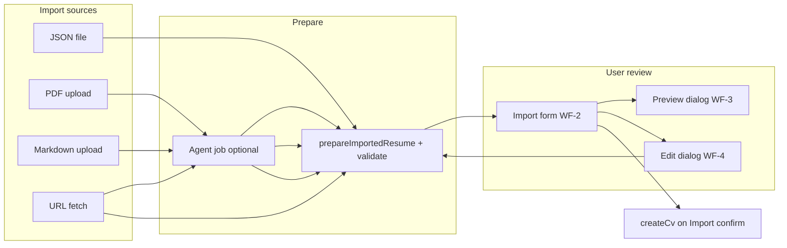

# Import preview — wireframes

Standalone wireframe reference for the `import-preview` change. Implementation details in `design.md`.

## Flow overview



## WF-1: Empty / invalid state

All import routes share this action bar pattern when no valid preview exists.

| Control | State                                                     |
| ------- | --------------------------------------------------------- |
| Import  | Disabled                                                  |
| Preview | Hidden or disabled                                        |
| Edit    | Disabled (JSON: enabled once file loaded even if invalid) |
| Cancel  | Enabled                                                   |

## WF-2: Ready to import

Applies to: JSON, PDF, Markdown, URL (JSON sync and HTML job success).

```
┌─────────────────────────────────────────────────────────────────┐
│  [Primary] Import                                               │
│  [Outline] Preview          → opens WF-3                        │
│  [Outline] ✎ Edit           → opens WF-4                        │
│  [Outline] Cancel                                               │
└─────────────────────────────────────────────────────────────────┘
```

Validation message: "JSON Resume data is valid."  
Optional Gravatar checkbox when image rules match existing `import-cv-preview` logic.

## WF-3: Preview dialog

| Region | Content                                                     |
| ------ | ----------------------------------------------------------- |
| Header | Title "Import preview", template `<Select>`, close button   |
| Body   | `<iframe srcDoc={renderResumeHtml(...)}>` with auto height  |
| Footer | Close only (no Import inside dialog — user returns to form) |

Compared to `/dashboard/cv/[id]/preview`:

| Feature                 | CV preview page | Import preview dialog |
| ----------------------- | --------------- | --------------------- |
| Template select         | Yes             | Yes                   |
| Layout / sections panel | Yes             | **No**                |
| Print / Download PDF    | Yes             | **No**                |
| Persist template        | Yes             | **No**                |
| Breadcrumb              | Yes             | **No**                |

## WF-4: Edit dialog

| Before                  | After            |
| ----------------------- | ---------------- |
| Button: `Edit JSON…`    | Button: `✎ Edit` |
| Title: Edit JSON Resume | Title: **Edit**  |

Behavior unchanged: Save commits to parent state; Cancel discards dialog edits.

## WF-5: Agent job in progress (PDF / Markdown / URL HTML)

```
Status banner: "Import in progress: {progress}"
All actions disabled except Cancel (optional: allow Cancel to stop polling only)
```

On `status: succeeded` + `previewData`: transition to WF-2.

## WF-6: URL import — removed UI

Remove the bordered **Preview** section that shows raw JSON in `<pre>`. Visual preview is only in WF-3.
