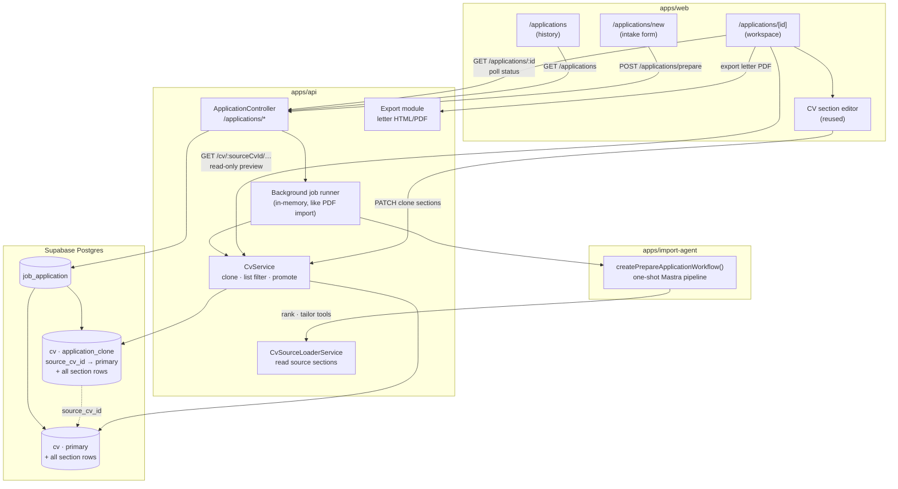
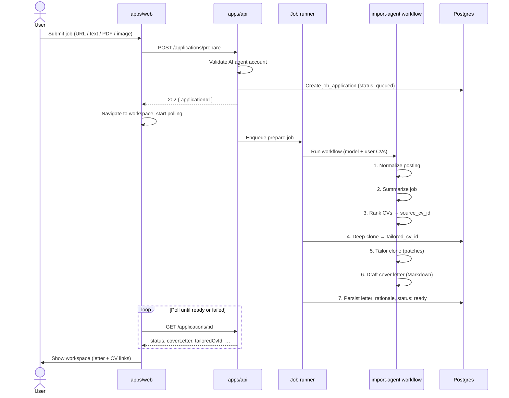
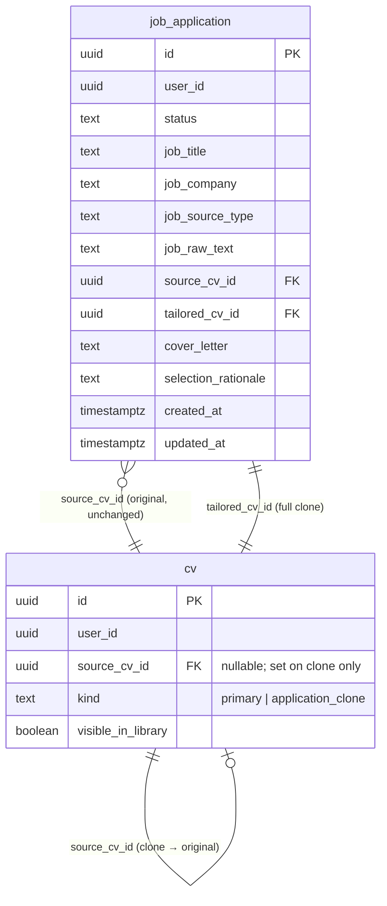
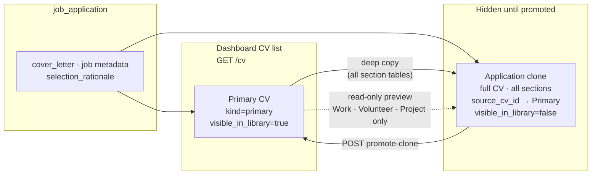
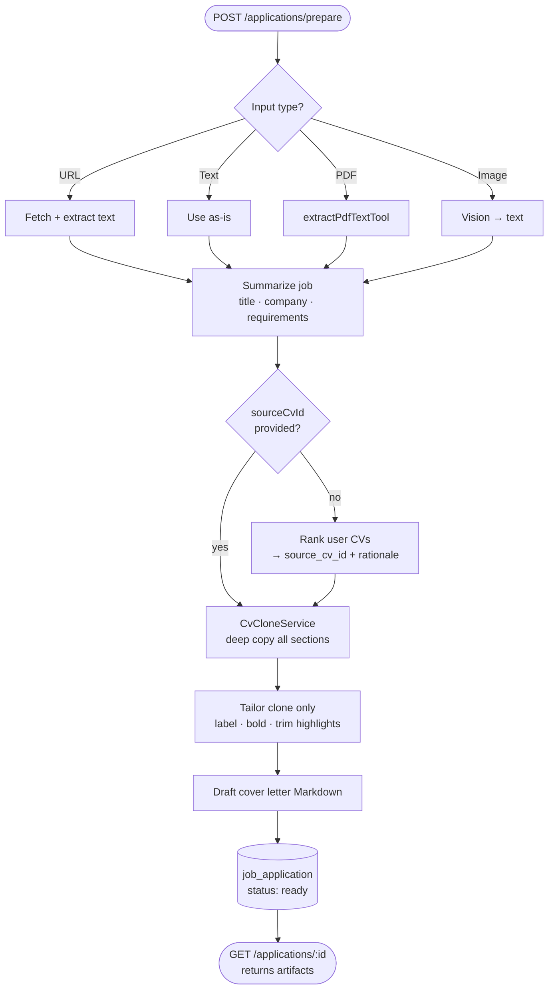
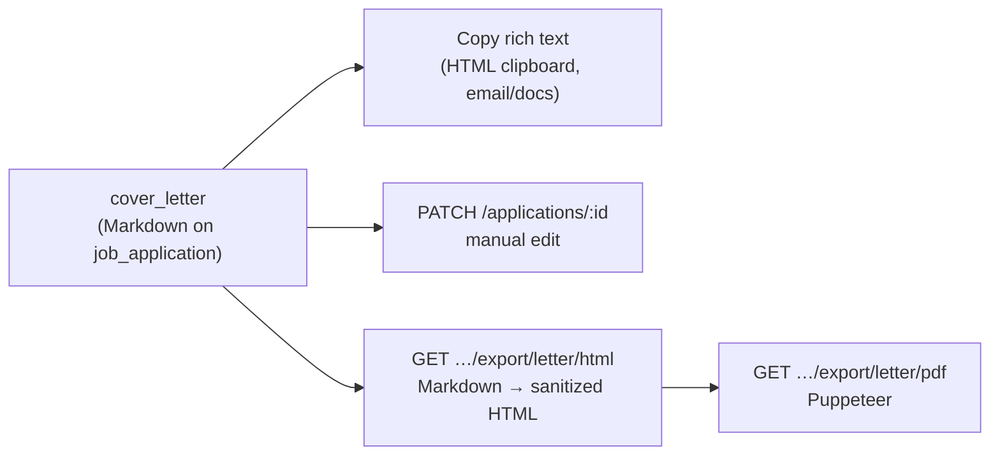

## Context

Resumind persists CVs in normalized Supabase tables and already runs **Mastra workflows** for PDF import (`apps/import-agent`, gated by the user's active AI agent account per `ai-agent-settings-menu`). The dashboard supports section-by-section editing and (in flight) API-side HTML/PDF export via `cv-html-view-pdf-export`. There is no concept of job postings, application packages, or CV clones.

The user wants a **single one-shot flow**—Prepare Application—not a job board (no search, favorites, or email alerts). Input is multimodal (URL, text, PDF, screenshot + optional user message). Output is a tailored CV clone and a cover letter in **Markdown**. Refinement after generation is **manual** via the existing CV editor and an editable letter field—not an AI chat. Application clones must stay out of the main CV library until promoted.

Architecturally, the core pattern is unchanged: a **copy of the CV** with a **`source_cv_id` reference** to the original, plus **utilities to load sections from the source** for tailoring and for the user to preview original Work/Volunteer/Project entries and copy portions into the clone. Tailoring only mutates the clone—never the source CV. No separate `inactive_highlights` storage; removed bullets are simply dropped from the clone's `highlights` array, and the user can recover text from the source preview.

## Diagrams & Wireframes

### System overview



### One-shot prepare sequence



### Data model & CV lineage

Primary CV and application clone are **the same `cv` entity**—full normalized resumes with identical child tables. The clone differs only by metadata: `kind = application_clone`, `source_cv_id` pointing at the original, and `visible_in_library = false`. Deep clone copies **every** section table (work, volunteer, education, skills, projects, awards, etc.). Source preview in the UI is limited to Work/Volunteer/Project for copying text back; that is not a schema constraint.





### Mastra workflow steps



### Cover letter export paths



### Wireframes

#### Applications list — `/dashboard/applications`

```
┌─────────────────────────────────────────────────────────────────────────────┐
│  Resumind          CVs    Applications    [Prepare Application +]    [User ▾]│
├─────────────────────────────────────────────────────────────────────────────┤
│                                                                             │
│  Applications                                                               │
│  ─────────────────────────────────────────────────────────────────────────  │
│                                                                             │
│  ┌─────────────────────────────────────────────────────────────────────┐   │
│  │ Senior Frontend Engineer · Acme Corp          ready    2 days ago  │   │
│  └─────────────────────────────────────────────────────────────────────┘   │
│  ┌─────────────────────────────────────────────────────────────────────┐   │
│  │ Product Designer · Studio X                   failed   1 week ago  │   │
│  └─────────────────────────────────────────────────────────────────────┘   │
│  ┌─────────────────────────────────────────────────────────────────────┐   │
│  │ …                                                                   │   │
│  └─────────────────────────────────────────────────────────────────────┘   │
│                                                                             │
└─────────────────────────────────────────────────────────────────────────────┘
```

#### Intake — `/dashboard/applications/new`

```
┌─────────────────────────────────────────────────────────────────────────────┐
│  ← Back to applications                                                     │
├─────────────────────────────────────────────────────────────────────────────┤
│                                                                             │
│  Prepare application                                                        │
│  Paste a job posting or upload a file. One run produces a tailored CV       │
│  and cover letter.                                                          │
│                                                                             │
│  Job source (pick one)                                                      │
│  ┌─────────────────────────────────────────────────────────────────────┐   │
│  │ ○ URL     [ https://company.com/jobs/123                          ] │   │
│  │ ○ Text    ┌─────────────────────────────────────────────────────┐   │   │
│  │           │ Paste job description…                              │   │   │
│  │           └─────────────────────────────────────────────────────┘   │   │
│  │ ○ File    [ Choose PDF or screenshot ]  job-posting.pdf             │   │
│  └─────────────────────────────────────────────────────────────────────┘   │
│                                                                             │
│  Base CV (optional)                                                         │
│  ○ Let AI pick best match    ○ Choose CV: [ Software Engineer CV      ▾]   │
│                                                                             │
│  Optional instruction                                                       │
│  ┌─────────────────────────────────────────────────────────────────────┐   │
│  │ Emphasize React and team lead experience…                           │   │
│  │ Write the letter in English… (overrides posting language)           │   │
│  └─────────────────────────────────────────────────────────────────────┘   │
│                                                                             │
│                              [ Prepare application ]                        │
│                                                                             │
└─────────────────────────────────────────────────────────────────────────────┘
```

#### Workspace (ready) — `/dashboard/applications/[id]`

```
┌─────────────────────────────────────────────────────────────────────────────┐
│  ← Applications    Senior Frontend Engineer · Acme Corp                     │
├─────────────────────────────────────────────────────────────────────────────┤
│                                                                             │
│  JOB SUMMARY                          │  COVER LETTER (Markdown)            │
│  ─────────────────                    │  ─────────────────────────          │
│  Title: Senior Frontend Engineer      │  ┌───────────────────────────────┐  │
│  Company: Acme Corp                   │  │ Dear hiring team,             │  │
│  Source: pasted text                  │  │                               │  │
│                                       │  │ I am excited to apply…        │  │
│  Why this CV:                         │  │                               │  │
│  "Strongest match for React +         │  │ …                             │  │
│   leadership bullets in work #2"      │  └───────────────────────────────┘  │
│                                       │  [Copy letter] [PDF ↓]                  │
│  TAILORED CV                          │                                       │
│  ─────────────────                    │                                       │
│  Clone from: Software Engineer CV     │                                       │
│  [ Edit CV sections ]  [ Export CV ]  │                                       │
│  [ Promote clone to library ]         │                                       │
│                                                                             │
└─────────────────────────────────────────────────────────────────────────────┘
```

#### Workspace (preparing) — polling state

```
┌─────────────────────────────────────────────────────────────────────────────┐
│  ← Applications    Preparing application…                                   │
├─────────────────────────────────────────────────────────────────────────────┤
│                                                                             │
│                    ◐  Analyzing job posting…                                │
│                    ─────────────────────────                                │
│                    • Normalizing posting          ✓                         │
│                    • Selecting best CV            …                         │
│                    • Cloning and tailoring                                  │
│                    • Writing cover letter                                   │
│                                                                             │
└─────────────────────────────────────────────────────────────────────────────┘
```

#### Work editor with source preview — clone context

```
┌─────────────────────────────────────────────────────────────────────────────┐
│  Application · Edit Work                              [ Save ] [ Cancel ]   │
├──────────────────────────────┬──────────────────────────────────────────────┤
│  CLONE (editable)            │  SOURCE (read-only)                          │
│  Acme Corp · Senior Dev      │  Same index: work #2 from Software Eng. CV   │
│  ─────────────────────       │  ─────────────────────────────────────────   │
│  2020 – Present              │  2020 – Present                              │
│  Summary                     │  Summary                                     │
│  ┌────────────────────────┐  │  ┌────────────────────────────────────────┐ │
│  │ Led frontend team…     │  │  │ Led frontend team of 5…                │ │
│  └────────────────────────┘  │  └────────────────────────────────────────┘ │
│                              │                          [ Copy summary ]    │
│  Highlights                  │  Highlights (original)                       │
│  • Built design system       │  • Built design system                       │
│  • **Reduced bundle 40%**    │  • Reduced bundle size by 40%  [ Copy ]      │
│  • Mentored juniors          │  • Mentored 3 junior developers [ Copy ]     │
│  [ + Add highlight ]         │  • Legacy PHP maintenance      [ Copy ]      │
│                              │    (removed from clone — copy to restore)    │
└──────────────────────────────┴──────────────────────────────────────────────┘
```

Rows match by **section type + index** at clone time. Reordering clone rows after prepare may desync preview index (documented limitation).

## Goals / Non-Goals

**Goals:**

- One guided flow from job posting → best CV match → cloned tailored CV + cover letter Markdown in a single workflow run.
- Deterministic persistence: `job_application` record, clone linked to `source_cv_id`, workflow status and selection rationale stored on the application row.
- Tailoring operations v1: update `basics.label`, Markdown bold in summaries/highlights, remove irrelevant bullets from the clone's `highlights` arrays (standard jsonb fields—no extra columns).
- Reuse active AI agent account credentials and Mastra patterns; extend `apps/import-agent` rather than duplicating agent infrastructure.
- Source-CV utilities: server-side loaders and read-only UI to fetch Work/Volunteer/Project from `source_cv_id`; user can copy summary or highlight text into the clone.
- Application workspace: job summary, Markdown letter (copy as rich text for email/docs, export PDF when needed), full CV editor on clone.
- Optional base CV picker on intake; when set, workflow uses that CV instead of AI ranking.
- `GET /cv` excludes non-promoted application clones; promote action makes clone visible in library.

**Non-Goals:**

- AI chat or multi-turn refinement of letter or CV after the initial generation.
- `inactive_highlights` or other parallel highlight storage—keep clone edits on normal `highlights` only.
- Job search, saved searches, favorites, notification emails, or in-app email sending.
- Scraping arbitrary job sites without user-provided content fallback (URL fetch may fail; user can paste text).
- Auto-merge tailored clone back into source CV.
- Separate LLM billing/config per feature (one global active AI agent account for v1, shared across PDF import and Prepare Application).
- OCR quality guarantees for screenshot-only postings (best-effort vision step; user can paste text if extraction fails).
- Real-time streaming tokens from LLM (workflow returns complete artifacts when finished).

## Decisions

### 1. Domain model: `job_application` + flagged CV clones

**Choice:**

| Entity            | Purpose                                                                                                                                                                        |
| ----------------- | ------------------------------------------------------------------------------------------------------------------------------------------------------------------------------ |
| `job_application` | User, status, job metadata (title, company, raw text, source type), `source_cv_id`, `tailored_cv_id`, `cover_letter` Markdown, optional `selection_rationale` text, timestamps |
| `cv` extensions   | `source_cv_id uuid null`, `kind text` (`primary` \| `application_clone`), `visible_in_library boolean default true`                                                            |

Clones created with `kind = application_clone`, `source_cv_id` set, `visible_in_library = false`. Promote sets `visible_in_library = true` (kind unchanged for audit).

**Rationale:** Keeps all CV editing/export machinery unchanged—clone is a normal CV row with flags. Avoids parallel editor code paths. No chat message table—one-shot output lives on `job_application`.

**Alternatives:**

- Store tailored JSON only on `job_application` — rejected; would bypass normalized editor and export.
- Soft-delete source linkage — rejected; explicit `source_cv_id` supports UI lineage and source loaders.

### 2. Source-CV utilities and preview (no `inactive_highlights`)

**Choice:** `CvCloneService` deep-copies normalized rows. **Source loaders** (service methods + Mastra tools) read Work/Volunteer/Project from `source_cv_id` without mutating the source:

- Workflow: `loadSourceBasics`, `loadSourceSectionSummary`, `loadSourceWorkItems`, etc.—for rank/tailor steps.
- UI: when editing a clone in the application workspace, show a **read-only preview** of the matching source Work/Volunteer/Project entry (matched by section type and row order from clone time). User actions: copy summary text, copy individual highlight, append highlight to clone via normal PATCH on `highlights`.

Tailor step removes bullets by writing a shorter `highlights` array on the clone—same as manual edit. To bring content back, user copies from source preview.

**Rationale:** Simple mental model—clone is a normal CV copy; source stays canonical reference. Avoids ambiguous inactive/active dual storage.

**Alternatives:**

- `inactive_highlights` jsonb — rejected; too ambiguous for users and export.
- `source_item_id` on each clone row — deferred; v1 matches by section + position index after deep copy.

### 3. Mastra workflow in `apps/import-agent` (one shot)

**Choice:** Export `createPrepareApplicationWorkflow()` with steps:

1. **Normalize job posting** — branch on input type (URL fetch, text, PDF extract, image vision)
2. **Summarize job** — structured fields: title, company, requirements[], keywords[]
3. **Select base CV** — use user-provided `source_cv_id` when present; otherwise LLM picks with rationale
4. **Clone** — deep copy normalized rows → new `cv` + children (`source_cv_id` set)
5. **Tailor clone** — patches on clone only: `basics.label`, Markdown bold in summaries/highlights, reduced `highlights` arrays (drop irrelevant bullets)
6. **Draft cover letter** — Markdown in the job posting language (or language specified in the user message) from job summary + tailored CV assembly
7. **Persist** — create `job_application` with `cover_letter`, `selection_rationale`, status `ready`

**Rationale:** Mirrors PDF import architecture; tools are unit-testable; no chat agent.

### 4. Async prepare, sync artifacts when ready

**Choice:**

- `POST /applications/prepare` → `{ applicationId, status: queued }` (202)
- Background runner executes workflow (in-memory job map like PDF import v1)
- `GET /applications/:id` → status, progress, ids, cover letter when ready
- Optional `PATCH /applications/:id` with `{ coverLetter }` for manual edits (no AI)

### 5. CV list filtering

**Choice:** `CvService.findAll` filters `visible_in_library = true`. `GET /cv/:id` returns clones by id. Source CV readable via same routes using `sourceCvId` from application detail.

### 6. Cover letter: Markdown storage, rich-text copy, PDF export

**Choice:** Store Markdown on `job_application`. Client copy action writes **rich text** (`text/html` from rendered Markdown, with `text/plain` fallback) so one paste preserves bold and paragraphs in email clients and word processors. PDF via Markdown → HTML → Puppeteer.

**Letter language:** Default to the job posting language (detected during normalize/summarize). If the optional user message explicitly requests another language, the draft step SHALL honor that override.

### 7. Optional base CV selection on intake

**Choice:** Intake form offers "Let AI pick" (default) or a dropdown of the user's library-visible CVs. When the user selects a CV, `POST /applications/prepare` sends `sourceCvId`; the workflow skips LLM ranking and uses that id (still records a short rationale such as "User selected"). When omitted, existing rank step applies.

**Rationale:** Reduces wrong-CV risk without blocking users who trust AI selection.

### 8. Screenshot upload size limit

**Choice:** Image job postings (PNG/JPEG/WebP) SHALL use the same maximum upload size as PDF import: **5 MB** (`PDF_IMPORT_MAX_BYTES` default, shared constant or env for application prepare).

### 9. AI agent credential gate

**Choice:** Reuse `AiAgentCredentialService.getActiveCredentials(user)` for `POST /applications/prepare`.

## Risks / Trade-offs

- **[Risk] URL fetch SSRF / ToS** → HTTPS only, size/time limits; pasted text fallback.
- **[Risk] Wrong CV selected** → Optional base CV picker on intake; persist `selection_rationale` either way.
- **[Risk] LLM corrupts CV schema** → Validated patch applier + `ResumeSchemaValidator`.
- **[Risk] One-shot quality** → Manual edit on clone; source preview to copy back removed content.
- **[Risk] Source/clone row matching** → Deep copy preserves order; preview matches by index within section; document limitation if user reorders clone rows.
- **[Trade-off] In-memory job store** → Same as PDF import.

## Migration Plan

1. Deploy migration: CV columns, `job_application`, indexes, RLS.
2. Deploy API with feature flag `APPLICATION_PREPARE_ENABLED` default true in dev.
3. Deploy web routes behind nav link.
4. Rollback: disable flag; new tables unused; CV columns nullable/no-op for existing rows.

## Resolved Questions

| Question                   | Decision                                                                       |
| -------------------------- | ------------------------------------------------------------------------------ |
| Base CV before prepare     | **v1 yes** — optional picker; default AI pick when unset                       |
| Screenshot max size        | **5 MB** — same as PDF import                                                  |
| Letter language            | **Job posting language** — unless user specifies otherwise in optional message |
| Copy format for email/docs | **Rich text** — HTML clipboard from Markdown (not plain text or raw Markdown)  |
